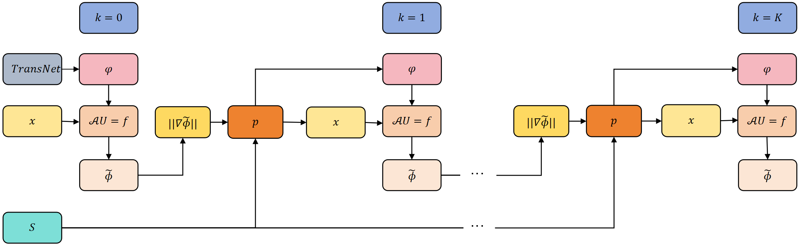

# AFCM

## Abstract·摘要

<table><tr><td width="50%">

Partial differential equations (PDEs) with near singular solutions pose significant challenges for traditional numerical methods, particularly in complex geometries where mesh generation and adaptive refinement become computationally expensive. While deep-learning-based approaches, such as Physics-Informed Neural Networks (PINNs) and the Random Feature Method (RFM), offer mesh-free alternatives, they often lack adaptive resolution in critical regions, limiting their accuracy for solutions with steep gradients or singularities.

In this work, we propose the ***Adaptive Feature Capture Method (AFCM)***, a novel machine learning framework that adaptively redistributes neurons and collocation points in high-gradient regions to enhance local expressive power. Inspired by adaptive moving mesh techniques, ***AFCM*** employs the gradient norm of an approximate solution as a monitor function to guide the reinitialization of feature function parameters. This ensures that partition hyperplanes and collocation points cluster where they are most needed, achieving higher resolution without increasing computational overhead.

The ***AFCM*** extends the capabilities of RFM to handle PDEs with near-singular solutions while preserving its mesh-free efficiency. Numerical experiments demonstrate the method's effectiveness in accurately resolving near-singular problems, even in complex geometries. By bridging the gap between adaptive mesh refinement and randomized neural networks, ***AFCM*** offers a robust and scalable approach for solving challenging PDEs in scientific and engineering applications.

</td><td>

具有近奇异解的偏微分方程（PDEs）对传统数值方法提出了重大挑战，尤其是在复杂几何区域中，网格生成和自适应加密会带来高昂的计算成本。尽管基于深度学习的方法（如物理信息神经网络（PINNs）和随机特征方法（RFM））提供了无网格的替代方案，但它们通常在关键区域缺乏自适应分辨率，从而限制了其对具有陡峭梯度或奇异性解的求解精度。

本文提出了一种新颖的机器学习框架：***自适应特征捕捉方法（Adaptive Feature Capture Method, AFCM）***，该方法能够自适应地在高梯度区域重新分布神经元和配置点，以增强局部表达能力。受自适应移动网格技术的启发，***AFCM*** 利用近似解的梯度范数作为监控函数（monitor function），指导特征函数参数的重初始化。这确保了划分超平面和配置点在最需要的位置聚集，从而在不增加计算开销的前提下实现更高的局部分辨率。

***AFCM*** 在保持 RFM 无网格高效性的同时，显著拓展了其处理近奇异解 PDE 的能力。数值实验表明，该方法即使在复杂几何区域中，也能高精度地解析近奇异问题。通过弥合自适应网格加密与随机化神经网络之间的鸿沟，***AFCM*** 为科学与工程应用中求解具有挑战性的偏微分方程提供了一种鲁棒且可扩展的新途径。

</td></tr></table>

## Introduction·引言

## 1·Introduction

<table><tr><td width="50%">

Partial differential equations (PDEs) are widely applied in diverse fields such as physics, engineering, economics, and biology [^Debnath2005Nonlinear], [^Achdou2014Partial], [^Leung2013Systems].
Traditional numerical methods, including finite difference [^LeVeque2007Finite], finite volume[^Moukalled2016Finite], and finite element methods [^Thom\'ee2007Galerkin], have made significant theoretical and practical contributions to solving PDEs.
However, these methods face notable challenges.
For instance, complex geometries often lead to distorted mesh elements, which degrade computational accuracy and efficiency [^LeVeque2007Finite], [^Zienkiewicz2005Finite], [^Rajendran2010Technique], [^Blazek2015Computational].

</td><td>

</td></tr>
<tr><td>

In contrast, the success of deep learning in computer vision and natural language processing [^Goodfellow2016Deep] has spurred interest in its application to scientific computing.
Neural networks, with their universal approximation capabilities [^Cybenko1989Approximation], have been explored for solving ordinary and partial differential equations (ODEs and PDEs) [^E2017Deep], [^Han2018Solving], [^E2018Deep], [^Sirignano2018Dgm], [^Zang2020Weak], [^Raissi2019Physics-Informed], [^E2021Algorithms], [^Lin2024Adaptive].
Various deep-learning-based approaches have emerged, such as the Deep Ritz Method (DRM) [^E2018Deep], Deep Galerkin Method (DGM) [^Sirignano2018Dgm], Physics-Informed Neural Networks (PINNs) [^Raissi2019Physics-Informed], and Weak Adversarial Networks (WAN) [^Zang2020Weak].
These methods offer mesh-free alternatives, circumventing the need for computationally intensive mesh generation.
However, a critical limitation of these approaches is the lack of reliable error estimation.
Without knowledge of the exact solution, numerical approximations often fail to exhibit clear convergence trends, even as network parameters increase [^Zhang2024Physics], raising concerns about their reliability in scientific and engineering applications.

</td><td>

</td></tr>
<tr><td>

Recent studies highlight the potential of randomized neural networks, such as the Extreme Learning Machine (ELM) [^Huang2006Extreme] or Random Feature Method (RFM) [^Neal2012Bayesian], [^Rahimi2007Random], for solving ODEs and PDEs.
ELM, a single-hidden-layer feedforward network, randomly initializes hidden-layer weights and biases while analytically optimizing output-layer weights via least squares [^Huang2015Trends].
This architecture eliminates the need for iterative training of hidden-layer parameters, offering significant computational efficiency over conventional deep networks.
As a mesh-free universal approximator [^Huang2006Extreme], [^Chen2022Bridging], [^Chen2023Random], [^Huang2006Universal] , ELM excels in handling PDEs in complex geometries.
Extensions like the Physics-Informed ELM (PIELM) [^Dwivedi2020Physics] have further demonstrated its utility in solving differential equations [^Chen2022Bridging], [^Chen2023Random], [^Calabr\`o2021Extreme], [^Dong2021Local], [^Dwivedi2020Physics], [^Fabiani2021Numerical], [^Yang2018Novel], [^Wang2024Extreme], [^Dang2024Adaptive], [^Sun2024Local], [^Huang2024Adaptive].

</td><td>

</td></tr>
<tr><td>

Building on these advances, the Random Feature Method (RFM) [^Chen2022Bridging] combines partition of unity (PoU) with random feature functions to solve linear PDEs in complex geometries, achieving high accuracy in both space and time.
However, for PDEs with near-singular solutions, RFM may struggle due to insufficient local expressive power in high-gradient regions.
In classic adaptive numerical methods, the mesh as well as the domain may be refined or decomposed, in order to improve the accuracy.
Adaptive mesh refinement techniques, such as the moving mesh method [^Ren2000Iterative], [^Huang2010Adaptive], address this issue by dynamically clustering mesh points in critical regions using monitor functions (e.g., solution gradients or error estimates).
Therefore, it is desirable to transfer such important and successful strategies to the field of neural-network-based solutions.

</td><td>

</td></tr>
<tr><td>

In this paper, we propose the Adaptive Feature Capture Method (AFCM), an extension of RFM that enhances resolution in high-gradient regions without increasing computational overhead.
The AFCM leverages the gradient norm of an approximate solution to redistribute feature function hyperplanes and collocation points, concentrating them in regions of steep gradients.
This adaptive refinement is iteratively applied until convergence, ensuring accurate approximations even for near-singular solutions.
Crucially, AFCM preserves the mesh-free nature of RFM, making it suitable for complex geometries while maintaining computational efficiency.
Numerical experiments validate the method’s effectiveness, demonstrating its potential for handling near-singular PDEs.
The remainder of this paper is organized as follows: Section 2 introduces the RFM and TransNet initialization.
Section 3 details the AFCM algorithm.
Section 4 presents numerical experiments, and Section 5 concludes with remarks and future directions.

</td><td>

</td></tr></table>

## 2·Preliminaries·预备知识

### Random Feature Method (RFM)·随机特征方法

<table><tr><td width="50%">

Consider the following linear boundary-value problem 

$$
\begin{aligned}
\begin{cases}\mathcal{L} \boldsymbol{\phi}(\boldsymbol{x})=\boldsymbol{f}(\boldsymbol{x}), & \boldsymbol{x} \in \Omega, \\ \mathcal{B} \boldsymbol{\phi}(\boldsymbol{x})=\boldsymbol{g}(\boldsymbol{x}), & \boldsymbol{x} \in \partial \Omega,\end{cases}
\end{aligned}
\tag{01}
$$

where $\Omega$ is a bounded spatial domain with the boundary $\partial \Omega$.
The $\mathcal{L}$ and $\mathcal{B}$ are linear differential and boundary operators, respectively.
We use $d$ and $d_{\phi}$ to denote the dimensions of $\boldsymbol{x}=(x_1,x_2,...,x_{d})$ and $\boldsymbol{\phi} = (\phi_1, \phi_2,...,\phi_{d_\phi})$, respectively.

In RFM, the domain $\Omega$ is partitioned into $M_p$ non-overlapping subdomains ${\Omega_n}$, each centered at $\boldsymbol{x}_n$, such that $\Omega =\cup_{n=1}^{M_p} \Omega_n$.
For each $\Omega_n$, RFM applies a linear transformation 

$$
\begin{aligned}
\tilde{\boldsymbol{x}}=\frac{1}{\boldsymbol{r}_n}\left(\boldsymbol{x}-\boldsymbol{x}_n\right), \quad n=1, \cdots, M_p,
\end{aligned}
\tag{02}
$$

to map $\Omega_n$ into $[-1,1]^d$, where $\boldsymbol{r}_n\in R^d$ represents the radius of $\Omega_n$.
The PoU function $\psi_n$ is defined such that $\operatorname{supp}(\psi_n) = \Omega_n$.

For $d=1$, two commonly used PoU functions are 
$$
\psi_n(\boldsymbol{x}) = \mathbb{I}_{[-1,1]}(\tilde{\boldsymbol{x}}),
\tag{03}
$$

and 

$$
\begin{aligned}
\psi_n(\boldsymbol{x}) &= \mathbb{I}_{\left[-\frac{5}{4},-\frac{3}{4}\right]}(\tilde{\boldsymbol{x}}) \frac{1+\sin (2 \pi \tilde{\boldsymbol{x}})}{2}\\
&+\mathbb{I}_{\left[-\frac{3}{4}, \frac{3}{4}\right]}(\tilde{\boldsymbol{x}})\\
&+\mathbb{I}_{\left[\frac{3}{4}, \frac{5}{4}\right]}(\tilde{\boldsymbol{x}}) \frac{1-\sin (2 \pi \tilde{\boldsymbol{x}})}{2}
\end{aligned}
\tag{04}
$$

where $\mathbb{I}_{[a,b]}(\boldsymbol{x})=1, \boldsymbol{x}\in[a,b]$ and $a\le b$.

For $d>1$, the PoU function $\psi_n(\boldsymbol{x})$ is defined as $\psi_n(\boldsymbol{x})=\Pi_{i=1}^{d} \psi_n\left(x_i\right)$.

Next, a random feature function $\varphi_{n j}$ on $\Omega_n$ is constructed using a two-layer neural network 

$$
\begin{aligned}
\varphi_{n j}(\boldsymbol{x})=\sigma\left(\boldsymbol{W}_{n j}\cdot \tilde{\boldsymbol{x}}+b_{n j}\right), \quad j=1,2, \cdots, J_n,
\end{aligned}
\tag{05}
$$

where $\sigma$ is the nonlinear activation function.
The $\boldsymbol{W}_{n j}$ and $b_{n j}$ are randomly generated from the uniform distribution $\mathbb{U}\left(-R_m, R_m\right)$ and then fixed.
The $R_m$ controls the magnitude of the parameters, and $J_n$ is the number of random feature functions.
The approximate solution in RFM is formed by a linear combination of the random feature functions and the PoU functions as follows 

$$
\begin{aligned}
\tilde{\boldsymbol{\phi}}(\boldsymbol{x})=\left(\sum_{n=1}^{M_p} \psi_n(\boldsymbol{x}) \sum_{j=1}^{J_n} u_{n j}^{1} \varphi_{n j}^{1}(\boldsymbol{x}),\cdots,\sum_{n=1}^{M_p} \psi_n(\boldsymbol{x}) \sum_{j=1}^{J_n} u_{n j}^{d_{\phi}} \varphi_{n j}^{d_{\phi}}(\boldsymbol{x})\right)^T,
\end{aligned}
\tag{06}
$$

where $u_{n j}^{i} \in \mathbb{R}$ are unknowns to be determined, and $M=\sum_{n=1}^{M_p}J_n$ denotes the degree of freedom.
Then, the linear least-squares method is utilized to minimize the loss function defined by 

$$
\begin{aligned}
\operatorname{Loss}\left(\left\{u_{n j}^{i}\right\}\right)=&\sum_{n=1}^{M_p}\left(\sum_{q=1}^{Q_n}\left\|\boldsymbol{\lambda}_{n, q}\left(\mathcal{L} \tilde{\boldsymbol{\phi}}\left(\boldsymbol{x}_{q}^{n}\right)-\boldsymbol{f}\left(\boldsymbol{x}_{q}^{n}\right)\right)\right\|_2^2\right)\\ &+\sum_{n=1}^{M_p}\left(\sum_{\boldsymbol{x}_{q}^{n} \in \partial \Omega}\left\|\boldsymbol{\lambda}_{n, b}\left(\mathcal{B}\tilde{\boldsymbol{\phi}}\left(\boldsymbol{x}_{q}^{n}\right)-\boldsymbol{g}\left(\boldsymbol{x}_{q}^{n}\right)\right)\right\|_2^2\right).
\end{aligned}
\tag{07}
$$

When employing the PoU function $\psi_n$ defined in [Eq.03](#eq.03), the regularization terms must be added to the loss function ([Eq.07](#eq.07)) to ensure continuity between neighboring subdomains.
In contrast, when utilizing the $\psi_n$ defined in [Eq.04](#eq.04), the regularization terms are not required.
The loss function ([Eq.07](#eq.07)) can be written in matrix form 

$$
\mathcal{A}\boldsymbol{U}=\boldsymbol{f}
\tag{08}
$$

where $\mathcal{A}$ is the coefficient matrix related to both $\mathcal{L} \tilde{\boldsymbol{\phi}}\left(\boldsymbol{x}_{q}^{n}\right)$ and $\mathcal{B} \tilde{\boldsymbol{\phi}}\left(\boldsymbol{x}_{q}^{n}\right)$, $\boldsymbol{f}$ is the right-hand side term associated with $\boldsymbol{f}\left(\boldsymbol{x}_{q}^{n}\right)$ and $\boldsymbol{g}\left(\boldsymbol{x}_{q}^{n}\right)$.
To find the optimal parameter set $\boldsymbol{U} =\left(u_{n j}^{i}\right)^T$, the RFM samples $Q_n$ collocation points $\left\{\boldsymbol{x}_{q}^{n}\right\}_{q=1}^{Q_n}$ within each subdomain $\Omega_n$.
It then calculates the rescaling parameters $\boldsymbol{\lambda}_{n, q}=diag(\lambda_{n, q}^{1},\cdots,\lambda_{n, q}^{d_{\phi}})$ and $\boldsymbol{\lambda}_{n, b}=diag(\lambda_{n, b}^{1},\cdots,\lambda_{n, b}^{d_{\phi}})$.
Specifically, the rescaling parameters are determined through the following formulas 

$$
\begin{aligned}
& \lambda_{n, q}^{i}=\frac{c}{\mathop{\max}\limits_{1\leq j \leq J_n}\left|\mathcal{L}\left(\psi_n(\boldsymbol{x}_{q}^{n})\varphi_{n j}^{i}(\boldsymbol{x}_{q}^{n}) \right)\right|}, \\ &\quad q=1, \cdots, Q_n, \ n=1, \cdots, M_p, \ i=1, \cdots, d_{\phi}, \\ &\lambda_{n, b}^{i}=\frac{c}{\mathop{\max}\limits_{1\leq j \leq J_n}\left|\mathcal{B}\left(\psi_n(\boldsymbol{x}_{q}^{n})\varphi_{n j}^{i}(\boldsymbol{x}_{q}^{n}) \right)\right|}, \\ &\quad \boldsymbol{x}_{q}^{n}\in{\partial\Omega}, \ n=1, \cdots, M_p, \ i=1, \cdots, d_{\phi},
\end{aligned}
\tag{09}
$$

where $c>0$ is a constant.
Finally, the numerical result is obtained using [Eq.06](#eq.06).

> **Remark 1**. (Nonlinear PDEs) When either the operator $\mathcal{L}$, the operator $\mathcal{B}$, or both are nonlinear, we opt to embed the least squares problem ([Eq.08](#eq.08)) into a nonlinear iterative solver, such as Picard's iterative method [^Ramos2009Picard’s], for solving the PDE.
> In each iteration, the PDE is linearized, allowing the coefficient $\boldsymbol{U}$ to be updated by solving [Eq.08](#eq.08) via the linear least-squares method.

</td><td>

</td></tr></table>

### Neural Feature Space·神经特征空间

<table><tr><td width="50%">

We follow the approach in [^Zhang2024Transferable].
For simplicity, let's assume $\Omega_n$ to be the unit ball $B_1(0)$.
For regions of other shapes and sizes, the target region can be embedded within the unit ball $B_1(0)$ via simple translations and scaling operations.
The random feature function $\varphi_{n j}$ on $\Omega_n$ is redefined as follows 

$$
\begin{aligned}
\varphi_{n j}(\boldsymbol{x}) &= \sigma\left(\boldsymbol{W}_{n j}\cdot \tilde{\boldsymbol{x}}+b_{n j}\right) \\
&= \sigma\left(\gamma_{n j}\left(\boldsymbol{a}_{n j}\cdot \tilde{\boldsymbol{x}}+r_{n j}\right)\right), \quad j=1,2, \cdots, J_n,
\end{aligned}
\tag{10}
$$

where $\tilde{\boldsymbol{x}}$ represents $\boldsymbol{x}$ after the linear transformation ([Eq.02](#eq.02)), $\boldsymbol{a}_{n j} = \frac{\boldsymbol{W}_{n j}}{\vert\boldsymbol{W}_{n j}\vert}$, $r_{n j} = \frac{b_{n j}}{\vert\boldsymbol{W}_{n j}\vert}$ and $\gamma_{n j} = \vert\boldsymbol{W}_{n j}\vert$.

The position of the partition hyperplane is determined by the location parameter $\left(\boldsymbol{a}_{n j}, r_{n j}\right)$ as follows 

$$
\begin{aligned}
\boldsymbol{a}_{n j}\cdot \tilde{\boldsymbol{x}}+r_{n j}=0, \quad j=1,2, \cdots, J_n,
\end{aligned}
\tag{11}
$$

where the unit vector $\boldsymbol{a}_{n j}$ represents the normal direction of the partition hyperplane and $\left|r_{n j}\right|$ indicates its distance from the origin.

The shape parameter $\gamma_{n j}$ modulates‌ the steepness of the pre-activation value $\gamma_{n j}\left(\boldsymbol{a}_{n j}\cdot \tilde{\boldsymbol{x}}+r_{n j}\right)$ in the normal direction $\boldsymbol{a}_{n j}$.

We define the distance from a point $\boldsymbol{x}$ to the partition hyperplane ([Eq.11](#eq.11)) of the random feature function $\varphi_{n j}$ on $\Omega_n$ as 

$$
\begin{aligned}
\operatorname{dist}_j(\boldsymbol{x})=\left|\boldsymbol{a}_{n j}\cdot \tilde{\boldsymbol{x}}+r_{n j}\right|, \quad j = 1,2,\cdots,J_n,
\end{aligned}
\tag{12}
$$

and the partition hyperplane density as 

$$
\begin{aligned}
D_{J_n}^{\tau}(\boldsymbol{x})=\frac{1}{J_n} \sum_{j=1}^{J_n} 1_{\operatorname{dist}_j(\boldsymbol{x})<\tau}(\boldsymbol{x}),
\end{aligned}
\tag{13}
$$

where $\tau>0$ denotes the bandwidth for density estimation, and $1_{\operatorname{dist}_j(\boldsymbol{x})<\tau}(\boldsymbol{x})$ represents the indicator function ‌evaluating whether the distance between $\boldsymbol{x}$ and the partition hyperplane of the random feature function $\varphi_{n j}$ on $\Omega_n$ satisfies $\operatorname{dist}_j(\boldsymbol{x}) < \tau$.
The $D_{J_n}^{\tau}(\boldsymbol{x})$ quantifies the proportion of the random feature functions whose partition hyperplanes intersect the ball $B_\tau(\boldsymbol{x})$, centered at $\boldsymbol{x}$ with radius $\tau$.

In solving PDEs, the distribution‌ of partition hyperplanes ([Eq.11](#eq.11)) within $\Omega_n$ can be controlled.
For example, in [^Zhang2024T}ransferable], uniform distribution of partition hyperplanes is preferred.
The location parameters $\left(\boldsymbol{a}_{n j}, r_{n j}\right)$ are randomly chosen as 

$$
\begin{aligned}
\boldsymbol{a}_{n j}=\frac{\boldsymbol{X}_{n j}}{\vert\boldsymbol{X}_{n j}\vert} \ \text{and} \ r_{n j}=D_{n j}, \quad j=1,2, \cdots, J_n,
\end{aligned}
\tag{14}
$$

where $\boldsymbol{X}_{n j}$ is distributed as a $d$-dimensional standard Gaussian distribution, and $D_{n j}$ follows a uniform distribution over $[0,1]$.
This sampling method generates a set of uniformly distributed partition hyperplanes ([Eq.11](#eq.11)) in $\Omega_n$.
For a fixed $\tau \in(0,1)$, the expectation has $\mathbb{E}\left[D_{J_n}^{\tau}(\boldsymbol{x})\right]=\tau$ when $\vert\tilde{\boldsymbol{x}}\vert \leq 1-\tau$.
The same shape parameter $\gamma_{nj} = \gamma_n$ are also adopted for all random feature functions $\varphi_{n j}$ defined on $\Omega_n$ .
To compute the optimal shape parameter $\gamma_n$, $L$ realizations of the Gaussian random fields (GRFs) $G\left(\boldsymbol{x} \mid \omega_l, \eta\right)_{l=1}^L$ are simulated, where $\omega_l$ denotes abstract randomness and $\eta$ represents a fixed correlation length.
The fitting error for each realization of GRFs and the approximate solution on $\Omega_n$ is defined as 

$$
\begin{aligned}
\operatorname{Loss}^{\gamma_n}_{l}=\min\limits_{\left\{u_{n j}\right\}}\left(\sum_{q=1}^{Q_n}\left\| \sum_{j=1}^{J_n} u_{n j}\sigma\left(\gamma_n\left(\boldsymbol{a}_{n j}\cdot \tilde{\boldsymbol{x}}_{q}^{n}+r_{n j}\right)\right)-G\left(\boldsymbol{x}_{q}^{n} \mid \omega_l, \eta\right)\right\|_2^2\right).
\end{aligned}
\tag{15}
$$

The optimal shape parameter $\gamma_n = \gamma_n^{opt}$ is obtained by 

$$
\begin{aligned}
\gamma_n^{o p t}=\arg \min _{\gamma_n} \frac{1}{L} \sum_{l=1}^L\operatorname{Loss}^{\gamma_n}_{l},
\end{aligned}
\tag{16}
$$

which can be solved via grid search.

</td><td>

</td></tr></table>

## 3·Methodology·方法

<table><tr><td width="50%">

We now present the Adaptive Feature Capture Method (AFCM).
For the boundary value problem in [Eq.01](#eq.01), we first partition the domain $\Omega$ into $M_p$ non-overlapping subdomains $\{\Omega_n\}_{n=1}^{M_p}$.
Within each $\Omega_n$, we sample $Q_n$ collocation points $\{\bm{x}_q^n\}_{q=1}^{Q_n}$ and construct $J_n$ feature functions $\{\varphi_{nj}\}_{j=1}^{J_n}$ using the methodology described in [Section.02.02: Neural Feature Space](#sec.02.02).
We employ the partition of unity (PoU) function $\psi_n$ defined in [Eq.03](#eq.03).
The total number of feature functions is denoted as $ J=\sum_{n=1}^{M_p} J_n$.
To ensure continuity between subdomains, regularization terms enforcing $C^1$ continuity conditions at interfaces are added to the loss function [Eq.07](#eq.07) following the approach in [^Dong2021Local].
The loss matrix ([Eq.08](#eq.08)) is then assembled and solved via linear least squares to obtain an initial approximate solution $\tilde{\bm{\phi}}(\bm{x})$.

The accuracy of this initial solution $\tilde{\bm{\phi}}(\bm{x})$ depends on the solution's regularity.
While satisfactory for smooth solutions, its performance degrades significantly for near-singular problems with steep gradients.
This limitation arises because uniformly distributed partition hyperplanes and collocation points in the Random Feature Method (RFM) lack sufficient local expressive power in high-gradient regions.
To address this, the AFCM adaptively increases feature function density and collocation point concentration in critical areas while preserving computational efficiency.

The adaptation process consists of two key components:

**Step 1: Feature Function Adaptation**

We enhance the density of partition hyperplanes and the steepness of feature function pre-activations in high-gradient regions by adjusting the shape parameter $\gamma_{nj}$ and location parameters $(\bm{a}_{nj}, r_{nj})$, using the gradient norm $|\nabla\tilde{\bm{\phi}}(\bm{x})|$ as an indicator.
We first uniformly sample $m$ points $S$ across $\Omega$ and define a probability density function (PDF) on $S$: 

$$
p(\bm{x}) = \frac{(|\nabla\tilde{\bm{\phi}}(\bm{x})| + c_1)}{\sum_{\bm{x}\in S}(|\nabla\tilde{\bm{\phi}}(\bm{x})| + c_1)}, \quad \bm{x} \in S,
\tag{17}
$$

where $c_1 > 0$ prevents excessive concentration.
From this PDF, we sample $J$ points via weighted random sampling (WRS) without replacement from the set $S$, with $\{\bm{x}_j^n\}_{j=1}^{J'_n}$ denoting points in $\Omega_n$ (note that $J'_n$ is usually different from $J_n$), where the weights for sampling are determined by the PDF.
The feature functions on $\Omega_n$ are reconstructed via:  

$$
\begin{aligned}
\gamma_{nj} &= \gamma_n \cdot \frac{(|\nabla\tilde{\bm{\phi}}(\bm{x}_j^n)| + c_2)}{\min_{\bm{x}\in\{\bm{x}_j^n\}_{j=1}^{J'_n}}(|\nabla\tilde{\bm{\phi}}(\bm{x})| + c_2)},
\end{aligned}
\tag{18}
$$

$$
\begin{aligned}
\bm{a}_{nj} &= \frac{\bm{X}_{nj}}{|\bm{X}_{nj}|}, \\
r_{nj} &= -\bm{a}_{nj} \cdot \tilde{\bm{x}}_j^n, \\
j&=1,\ldots,J'_n,
\end{aligned}
\tag{19}
$$

where $\gamma_n$ is the initial shape parameter from [Eq.15](#eq.15) and [Eq.16](#eq.16), $\bm{X}_{nj}$ follows a $d$-dimensional standard Gaussian distribution, and $c_2 > 0$ controls shape parameter variation to avoid numerical instability.

During the adaptation process, [Eq.18](#eq.18) determines the shape parameter $\gamma_{nj}$ at each sampling point $\bm{x}_j^n$ by scaling the initial constant $\gamma_n$ proportionally to the local gradient magnitude $|\nabla\tilde{\bm{\phi}}(\bm{x}_j^n)|$.
This proportional scaling ensures feature functions become steeper in high-gradient regions while maintaining moderate variations elsewhere.
Specifically, locations with larger solution gradients receive amplified $\gamma_{nj}$ values, enhancing local approximation capability without global parameter modifications.

[Eq.19](#eq.19) geometrically enforces that each feature function's partition hyperplane intersects its corresponding sampling point $\bm{x}_j^n$.
This critical constraint ensures the adapted basis functions remain anchored to regions requiring enhanced resolution, creating a dynamic alignment between network architecture and solution characteristics.

**Step 2: Collocation Point Adaptation**

Interior collocation points are redistributed to high-gradient regions using the same PDF $p(\bm{x})$.
We sample $\sum_{n=1}^{M_p} I_n$ points via WRS without replacement from the set $S$, with $\{\bm{x}_i^n\}_{i=1}^{I'_n}$ denoting interior points in $\Omega_n$, where the weights for sampling are determined by the PDF.
The updated collocation points on $\Omega_n$ become: 

$$
\left\{\bm{x}_q^n \mid \bm{x}_q^n \in \partial\Omega_n\right\} \cup \left\{\bm{x}_i^n\right\}_{i=1}^{I'_n}.
\tag{20}
$$

After these adaptations, the loss matrix ([Eq.08](#eq.08)) is reassembled and solved to obtain an improved approximation $\tilde{\bm{\phi}}(\bm{x})$.
The AFCM iteratively applies this process until convergence, as formalized in [Algorithm.01](#algo.01).
[Fig.01](#fig.01) illustrates the computational framework.

</td><td>

</td></tr>
<tr><td colspan="2">

**<a id="fig.01">Fig.01</a>: The computational framework of [Algorithm.01](#algo.01).**

</td></tr>
<tr><td>

This adaptive strategy ensures that partition hyperplanes and collocation points cluster in critical regions, achieving enhanced resolution without increasing computational overhead.
The mesh-free nature of RFM is preserved, making AFCM suitable for complex geometries while maintaining efficiency.

</td><td>

</td></tr></table>

<table><tr><td width="50%">

**<a id="algo.01">Algorithm.01</a>: The Adaptive Feature Capture Method**

Input:
-  Number of subdomains $M_p$
-  Number of feature functions per subdomain $J_n$
-  Number of collocation points per subdomain $Q_n$
-  Number of interior collocation points per subdomain $I_n$
-  Rescaling parameter $c$, coefficients $c_1$, $c_2$
-  Number of iterations $K$
-  Number of sampling points $m$
-  Number of GRF realizations $L$
-  Correlation length $\ell_{\eta}$

Output: The $K$-th approximate solution $\tilde{\boldsymbol{\phi}}(\boldsymbol{x})$;

Divide $\Omega$ into $M_p$ non-overlapping subdomains ${\Omega_n}$;

For $k = 0$:
1. Sample $Q_n$ collocation points $\left\{ \boldsymbol{x}_{q}^{n}\right\}_{q=1}^{Q_n}$ in each $\Omega_n$;
2. Generate $J_n $ location parameters $\{\left(\boldsymbol{a}_{n j}, r_{n j}\right)\}_{j=1}^{J_{n}}$ on $\Omega_n$ according to [Eq.14](#eq.14);
3. Compute the shape parameter $\gamma_n$ on $\Omega_n$ according to [Eq.15](#eq.15) and [Eq.16](#eq.16);
4. Construct $J_n$ feature functions $\{\varphi_{n j}\}_{j=1}^{J_n}$ on $\Omega_n$ by [Eq.10](#eq.10);
5. Assemble the loss matrix ([Eq.08](#eq.08)) and solve it by the linear least-squares method to obtain the $k$-th approximate solution $\tilde{\boldsymbol{\phi}}(\boldsymbol{x})$;

Sample $m$ points $S$ in the entire $\Omega$ by the uniform distribution;

For $k = 1,2, \cdots, K$:
1. Define PDF $p(\boldsymbol{x})$ for the points $S$ according to [Eq.17](#eq.17);
2. Sample $\sum_{n=1}^{M_p}J_n$ points from $S$ according to $p(\boldsymbol{x})$ and reconstruct the feature functions $\{\varphi_{n j}\}_{j=1}^{J'_n}$ on $\Omega_n$ by [Eq.18](#eq.18) and [Eq.19](#eq.19)
3. Sample $\sum_{n=1}^{M_p}I_n$ points from $S$ according to $p(\boldsymbol{x})$ and regenerate the collocation points on $\Omega_n$ according to [Eq.20](#eq.20).
4. Assemble the loss matrix ([Eq.08](#eq.08)) and solve it by the linear least-squares method to obtain the $k$-th approximate solut

</td><td>

</td></tr></table>

## 4·Experiments·实验

## 5·Conclusions·结论

<table><tr><td width="50%">

In this work, we propose the adaptive feature capture method (AFCM) based on RFM, a novel approach specifically developed to handle PDEs with near singular solutions while maintaining high numerical accuracy without requiring additional computational resources and the prior information of the exact solutions.
Building on TransNet's initialization framework, the AFCM employs the gradient norm of the approximate solutions of RFM as an indicator.
This mechanism drives the partition hyperplanes of feature functions and collocation points to concentrate in regions characterized by larger solution gradients.
Within these regions, the method further enhances the steepness of feature functions' pre-activation values along the normal directions of the partition hyperplanes.
Consequently, the AFCM achieves enhanced local expressive power in high-gradient regions, thereby yielding more accurate approximations.
The AFCM repeats this adaptation process until no further improvement in the approximate solutions can be made.
The proposed method delivers high accuracy in both space and time.
As a mesh-free algorithm, it is inherently adaptable to complex geometric configurations and demonstrates efficacy in solving near-singular PDEs.
We show a series of numerical experiments to validate our method.
Results consistently confirm the stability and accuracy of the AFCM.
Future work will explore extensions of this methodology to broader classes of PDEs and applications.

</td><td>

</td></tr></table>

## References·参考文献

[^Debnath2005Nonlinear]: Nonlinear Partial Differential Equations for Scientists and Engineers.
[^Achdou2014Partial]: Partial Differential Equation Models in Macroeconomics. Philosophical Transactions of the Royal Society A: Mathematical, Physical and Engineering Sciences 2014.
[^Leung2013Systems]: Systems of Nonlinear Partial Differential Equations: Applications to Biology and Engineering.
[^LeVeque2007Finite]: Finite Difference Methods for Ordinary and Partial Differential Equations: Steady-
and Time-Dependent Problems.
[^Moukalled2016Finite]: The Finite Volume Method.
[^Thom\'ee2007Galerkin]: Galerkin Finite Element Methods for Parabolic Problems.
[^Zienkiewicz2005Finite]: The Finite Element Method: Its Basis and Fundamentals.
[^Rajendran2010Technique]: A Technique to Develop Mesh-Distortion Immune Finite Elements. Computer Methods in Applied Mechanics and Engineering 2010.
[^Blazek2015Computational]: Computational Fluid Dynamics: Principles and Applications.
[^Goodfellow2016Deep]: Deep Learning.
[^Cybenko1989Approximation]: Approximation by Superpositions of a Sigmoidal Function. Mathematics of Control, Signals and Systems 1989.
[^E2017Deep]: Deep Learning-Based Numerical Methods for High-Dimensional Parabolic Partial Differential Equations and Backward Stochastic Differential Equations. Communications in Mathematics and Statistics 2017.
[^Han2018Solving]: Solving High-Dimensional Partial Differential Equations Using Deep Learning. Proceedings of the National Academy of Sciences 2018.
[^E2018Deep]: The Deep Ritz Method: A Deep Learning-Based Numerical Algorithm for Solving Variational Problems. Communications in Mathematics and Statistics 2018.
[^Sirignano2018Dgm]: DGM: A Deep Learning Algorithm for Solving Partial Differential Equations. Journal of Computational Physics 2018.
[^Zang2020Weak]: Weak Adversarial Networks for High-Dimensional Partial Differential Equations. Journal of Computational Physics 2020.
[^Raissi2019Physics-Informed]: Physics-Informed Neural Networks: A Deep Learning Framework for Solving Forward and Inverse Problems Involving Nonlinear Partial Differential Equations. Journal of Computational Physics 2019.
[^E2021Algorithms]: Algorithms for Solving High Dimensional PDEs: From Nonlinear Monte Carlo to Machine Learning. Nonlinearity 2021.
[^Lin2024Adaptive]: Adaptive Neural Network Subspace Method for Solving Partial Differential Equations With High Accuracy. arXiv:2412.02586.
[^Zhang2024Physics]: Physics Informed Neural Networks (PINNs) as Intelligent Computing Technique for Solving Partial Differential Equations: Limitation and Future Prospects. arXiv:2411.18240.
[^Huang2006Extreme]: Extreme Learning Machine: Theory and Applications. Neurocomputing 2006.
[^Neal2012Bayesian]: Bayesian Learning for Neural Networks.
[^Rahimi2007Random]: Random Features for Large-Scale Kernel Machines. Proceedings of the 21st International Conference on Neural Information Processing Systems 2007.
[^Huang2015Trends]: Trends in Extreme Learning Machines: A Review. Neural Networks 2015.
[^Chen2022Bridging]: Bridging Traditional and Machine Learning-Based Algorithms for Solving PDEs: The Random Feature Method. J Mach Learn 2022.
[^Chen2023Random]: The Random Feature Method for Time-Dependent Problems. arXiv:2304.06913.
[^Huang2006Universal]: Universal Approximation Using Incremental Constructive Feedforward Networks With Random Hidden Nodes. IEEE Transactions on Neural Networks 2006.
[^Dwivedi2020Physics]: Physics Informed Extreme Learning Machine (PIELM)--A Rapid Method for the Numerical Solution of Partial Differential Equations. Neurocomputing 2020.
[^Calabr\`o2021Extreme]: Extreme Learning Machine Collocation for the Numerical Solution of Elliptic PDEs With Sharp Gradients. Computer Methods in Applied Mechanics and Engineering 2021.
[^Dong2021Local]: Local Extreme Learning Machines and Domain Decomposition for Solving Linear and Nonlinear Partial Differential Equations. Computer Methods in Applied Mechanics and Engineering 2021.
[^Fabiani2021Numerical]: Numerical Solution and Bifurcation Analysis of Nonlinear Partial Differential Equations With Extreme Learning Machines. Journal of Scientific Computing 2021.
[^Yang2018Novel]: A Novel Improved Extreme Learning Machine Algorithm in Solving Ordinary Differential Equations by Legendre Neural Network Methods. Advances in Difference Equations 2018.
[^Wang2024Extreme]: An Extreme Learning Machine-Based Method for Computational PDEs in Higher Dimensions. Computer Methods in Applied Mechanics and Engineering 2024.
[^Dang2024Adaptive]: Adaptive Growing Randomized Neural Networks for Solving Partial Differential Equations. arXiv:2408.17225.
[^Sun2024Local]: Local Randomized Neural Networks With Discontinuous Galerkin Methods for Partial Differential Equations. Journal of Computational and Applied Mathematics 2024.
[^Huang2024Adaptive]: Adaptive Neural Network Basis Methods for Partial Differential Equations With Low-Regular Solutions. arXiv:2411.01998.
[^Ren2000Iterative]: An Iterative Grid Redistribution Method for Singular Problems in Multiple Dimensions. Journal of Computational Physics 2000.
[^Huang2010Adaptive]: Adaptive Moving Mesh Method.
[^Zhang2024Transferable]: Transferable Neural Networks for Partial Differential Equations. Journal of Scientific Computing 2024.
[^Ramos2009Picard’s]: Picard’s Iterative Method for Nonlinear Advection--Reaction--Diffusion Equations. Applied Mathematics and Computation 2009.